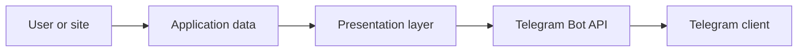

# Threat model: Telegram message presentation

## Executive summary

Scope ограничен новым слоем подготовки и доставки сообщений Telegram. Главный риск — вывод
пользовательских или внешних данных как Telegram HTML. Он снижен централизованным escaping и
ограничением длины свободного текста; подтверждённых высоких рисков в diff нет.

## Scope and assumptions

В scope: `app/telegram/presentation/`, Telegram handlers и notification services. Вне scope:
HTTP API, JWT/RBAC, инфраструктура, webhook verification и Mini App. Предполагается, что
данные лида, профиля и описание ATXG могут быть attacker-controlled, а Bot API доступен только
через настроенный bot client.

## System model

### Primary components

`messages.py` и notification services формируют факты; presentation layer экранирует их и
выбирает Rich либо regular HTML; aiogram отправляет данные в Telegram Bot API.

### Data flows and trust boundaries

- Пользователь или сайт → база данных: имя, контакт и комментарий становятся persisted input.
- База данных/services → presentation: строки пересекают boundary trusted code / untrusted data;
  `build_message` экранирует их.
- Presentation → Telegram Bot API: HTML и keyboard передаются через authenticated bot client;
  при неподдержке Rich применяется regular HTML.

#### Diagram

## Assets and security objectives

| Asset | Why it matters | Security objective |
| --- | --- | --- |
| User-visible message integrity | Fake markup or altered facts can mislead an exchange customer | I |
| Lead contact details | Exposure is personal-data leakage | C |
| Bot delivery availability | Duplicate or oversized sends impair operations | A/I |

## Attacker model

### Capabilities

An attacker can submit a site-lead comment, set profile-derived display text or cause external
ATXG description data to contain markup-like content.

### Non-capabilities

The attacker is not assumed to possess the bot token, manager account or production deployment
access.

## Entry points and attack surfaces

| Surface | How reached | Trust boundary | Notes | Evidence |
| --- | --- | --- | --- | --- |
| Site lead fields | Public site then database | persisted input → Telegram HTML | Comment is truncated and escaped | `app/services/site_lead_notifications.py:60` |
| ATXG description | Service data | service → Telegram HTML | Builder escapes facts | `app/services/aex_notifications.py:101` |
| Profile/order facts | Telegram and database | persisted input → Telegram HTML | Common builder escapes labels and values | `app/telegram/presentation/components.py:38` |

## Top abuse paths

1. Submit `<a>`-like text in a lead → it reaches manager notification → escaping renders it as
   text, not markup.
2. Send a very long lead comment → builder truncates only this free-text field → message remains
   within controlled size.
3. Trigger an unsupported Rich API response → delivery performs one regular fallback → no
   duplicate financial/status notification.

## Threat model table

| Threat ID | Threat source | Prerequisites | Threat action | Impact | Impacted assets | Existing controls (evidence) | Gaps | Recommended mitigations | Detection ideas | Likelihood | Impact severity | Priority |
| --- | --- | --- | --- | --- | --- | --- | --- | --- | --- | --- | --- | --- |
| TM-001 | Site visitor | Can submit lead text | Inject Telegram HTML | Misleading manager card | Message integrity | `escape_html`, `build_message` | None in scope | Keep builders as the only HTML sink | Alert on delivery validation errors | Low | Medium | Low |
| TM-002 | External/persisted data | Can control a description | Oversize a payload | Delivery failure or noise | Availability | 1,000-char lead truncation; 4,096 broadcast schema cap | Rich per-message cap remains enforced by model | Add per-family size tests when adding large templates | Count rejected payloads | Low | Low | Low |
| TM-003 | Telegram API failure | Rich unavailable | Cause duplicate send | Customer confusion | Delivery integrity | One fallback in `deliver` | Production API capability is external | Monitor fallback rate | Metric for `used_fallback` | Low | Medium | Low |

## Criticality calibration

Critical would require bot-token theft or auth bypass; high would require cross-user financial
data disclosure; medium would be repeatable customer-facing message forgery; low covers a bounded
delivery degradation. None is confirmed in this scope.

## Focus paths for security review

| Path | Why it matters | Related Threat IDs |
| --- | --- | --- |
| `app/telegram/presentation/delivery.py` | Rich/fallback error classification | TM-003 |
| `app/telegram/presentation/components.py` | Common HTML sink | TM-001, TM-002 |
| `app/services/site_lead_notifications.py` | External free-text boundary | TM-001, TM-002 |

## Quality check

Outbound Telegram and persisted-input boundaries are covered. Runtime code is separated from
tests/tooling. Deployment exposure and webhook authentication remain explicit out-of-scope
assumptions for this narrow diff model.
